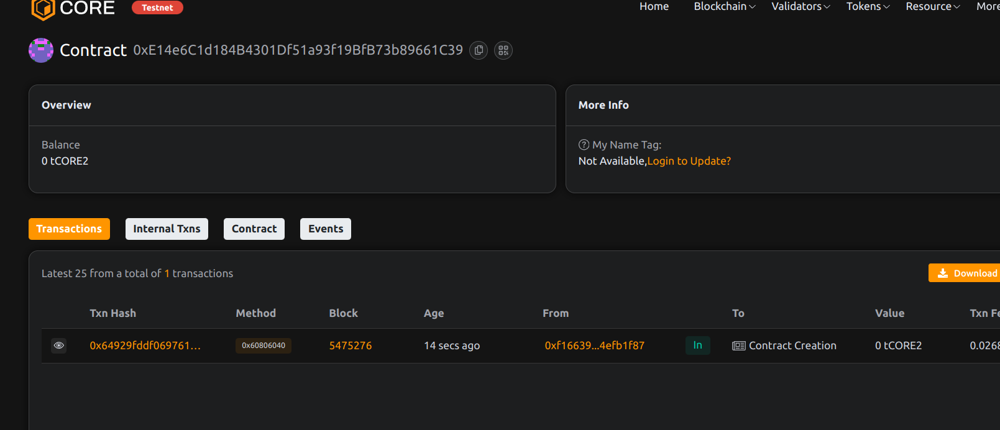

# EscrowX: Smart Contract-Based Escrow for Freelancers and Clients

## Project Title
EscrowX - Decentralized Escrow Platform 

## Project Description
EscrowX is a blockchain-powered escrow platform designed to provide secure, transparent, and trustless transactions between freelancers and clients. By leveraging smart contract technology, EscrowX ensures fair compensation and reduces the risk of payment disputes.
 
## Project Vision
To revolutionize freelance work by creating a transparent, secure, and efficient payment mechanism that protects both clients and freelancers through blockchain technology.

## Key Features
- Secure Project Funding
- Transparent Transaction Tracking
- Client-Controlled Fund Release
- No Intermediary Fees
- Immutable Project Records

## Future Scope
- Multi-Token Support
- Dispute Resolution Mechanism
- Reputation Scoring System
- Integration with Project Management Tools
- Cross-Chain Compatibility

## Contract Details
0xE14e6C1d184B4301Df51a93f19BfB73b89661C39

